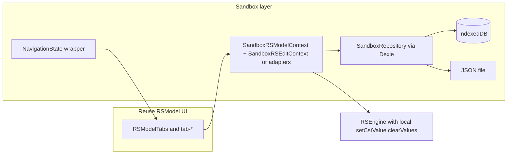

# Sandbox: offline RSModel + RSForm

## Decisions (locked in)

These are the product and engineering choices agreed during implementation planning; they override older text where something sounded optional.

| Topic                                  | Decision                                                                                                                                                                                                                                                                                                                                                                                                                                                                                                                                                                                                                                     |
| -------------------------------------- | -------------------------------------------------------------------------------------------------------------------------------------------------------------------------------------------------------------------------------------------------------------------------------------------------------------------------------------------------------------------------------------------------------------------------------------------------------------------------------------------------------------------------------------------------------------------------------------------------------------------------------------------- |
| **Isolation from existing features**   | **Do not** change RSForm, RSMODEL, or Library **backend hooks** (`use-update-constituenta`, `use-update-item`, `rsformsApi`, etc.) to add sandbox or offline branches. Sandbox behavior is implemented only under [`features/sandbox`](../rsconcept/frontend/src/features/sandbox/).                                                                                                                                                                                                                                                                                                                                                         |
| **Sandbox API surface**                | A **separate local API**: TypeScript interfaces (`ISandboxRSFormSchemaMutations`, `ISandboxLibraryItemWrite`, `ISandboxModelValuesApi`) and **factory** functions (`createSandboxRSFormSchemaMutations`, `createSandboxLibraryItemWrite`, `createSandboxModelValuesApi`) that update a `SandboxBundle` and call `persist`. They mirror the _shape_ of server operations where the UI needs it, but are not the same modules as production.                                                                                                                                                                                                   |
| **React wiring**                       | [`SandboxEditorApisProvider` / `useSandboxEditorApis`](../rsconcept/frontend/src/features/sandbox/pages/sandbox-editor/sandbox-editor-apis-context.tsx) expose the three API surfaces to **sandbox-only** components. Parent supplies [`SandboxMutationSinkOptions`](../rsconcept/frontend/src/features/sandbox/backend/sandbox-mutation-sink.ts) (`getBundle`, `setBundle`, `persist`). Future sandbox pages fork or wrap UI that needs these calls; production screens keep using existing hooks unchanged.                                                                                                                                |
| **DTO transforms**                     | Pure offline transforms live in [`sandbox-mutations.ts`](../rsconcept/frontend/src/features/sandbox/backend/sandbox-mutations.ts) (`offline*` functions). Canonical data remains `RSFormDTO` + `RSModelDTO` inside the bundle.                                                                                                                                                                                                                                                                                                                                                                                                               |
| **No shared “offline session” in app** | The earlier `OfflineEditorSession` / hook delegation approach was **rejected**. Nothing in `@/app` provides sandbox mutation overrides for production hooks.                                                                                                                                                                                                                                                                                                                                                                                                                                                                                 |
| **Folder layout**                      | Sandbox follows the same **feature layout** as RSForm/RSMODEL/OSS: [`backend/`](../rsconcept/frontend/src/features/sandbox/backend/) (types, Dexie, repository, mutations, API factories), [`pages/sandbox-page/`](../rsconcept/frontend/src/features/sandbox/pages/sandbox-page/) (launcher/entry), [`pages/sandbox-editor/`](../rsconcept/frontend/src/features/sandbox/pages/sandbox-editor/) (editor shell, APIs context). Optional barrel [`index.ts`](../rsconcept/frontend/src/features/sandbox/index.ts) at feature root. **No** top-level `api/` or `context/` folders at feature root—backend versus pages mirrors other features. |
| **Navigation**                         | [`NavigationState`](../rsconcept/frontend/src/app/navigation/navigation-context.tsx) may accept an optional `sandbox` config so `gotoRSForm` / `gotoCstEdit` / etc. keep the user on the sandbox editor URL with `tab` / `active` query params. This is an app-router concern, not part of RSForm/RSMODEL backends.                                                                                                                                                                                                                                                                                                                          |
| **Starter data**                       | First-load seed is built in code via [`create-starter-bundle.ts`](../rsconcept/frontend/src/features/sandbox/backend/create-starter-bundle.ts) when Dexie is empty (optional `public/sandbox/*.json` remains a possible enhancement).                                                                                                                                                                                                                                                                                                                                                                                                        |

---

# Sandbox: offline RSModel + RSForm (baseline doc)

## Current baseline (from codebase)

- **Route**: [`rsconcept/frontend/src/app/router.tsx`](../rsconcept/frontend/src/app/router.tsx) mounts sandbox under [`LandingLayout`](../rsconcept/frontend/src/app/landing-layout.tsx) at `urls.sandbox` (no `ApplicationLayout` / library shell). Placeholder: [`rsconcept/frontend/src/features/sandbox/pages/sandbox-page/sandbox-page.tsx`](../rsconcept/frontend/src/features/sandbox/pages/sandbox-page/sandbox-page.tsx).
- **RSModel wiring**: [`RSModelState`](../rsconcept/frontend/src/features/rsmodel/pages/rsmodel-page/rsmodel-state.tsx) loads model + schema via [`useRSModel`](../rsconcept/frontend/src/features/rsmodel/backend/use-rsmodel.ts) / [`useRSForm`](../rsconcept/frontend/src/features/rsform/backend/use-rsform.ts), builds [`RSEngine`](../rsconcept/frontend/src/features/rsmodel/models/rsengine.ts) with [`useSetValue`](../rsconcept/frontend/src/features/rsmodel/backend/use-set-value.ts) / [`useClearValues`](../rsconcept/frontend/src/features/rsmodel/backend/use-clear-values.ts) (API mutations), and nests [`RSEditState`](../rsconcept/frontend/src/features/rsform/pages/rsform-page/rsedit-state.tsx) for schema editing (many more API hooks).
- **RSForm graph**: [`loadRSForm`](../rsconcept/frontend/src/features/rsform/backend/rsform-loader.ts) turns `RSFormDTO` into the rich [`RSForm`](../rsconcept/frontend/src/features/rsform/models/rsform.ts) used by tabs ([`RSModelTabs`](../rsconcept/frontend/src/features/rsmodel/pages/rsmodel-page/rsmodel-tabs.tsx) reuses RSForm tab components).
- **Navigation**: [`NavigationState`](../rsconcept/frontend/src/app/navigation/navigation-context.tsx) is **not** provided by `LandingLayout`; any reuse of `RSModelTabs` / `useConceptNavigation` / [`useBlockNavigation`](../rsconcept/frontend/src/app/navigation/navigation-context.tsx) requires wrapping the sandbox workspace in `NavigationState` (tab/active query params already work relative to **current** pathname).
- **Persistence today**: only small `localStorage` usage (e.g. preferences); **no IndexedDB / PWA** in the frontend stack yet ([`package.json`](../rsconcept/frontend/package.json)).
- **Menus**: [`MenuRSModel`](../rsconcept/frontend/src/features/rsmodel/pages/rsmodel-page/menu-rsmodel.tsx) / [`MenuEditSchema`](../rsconcept/frontend/src/features/rsform/pages/rsform-page/menu-edit-schema.tsx) depend on auth, dialogs, and API-backed hooks—sandbox needs trimmed or alternate menus so only **locally implemented** actions appear.

## First iteration (MVP) scope

- **Single editable RSModel** in the sandbox: one conceptual model the user works on, always paired with **exactly one RSForm** (`model.schema` points at that form’s `id`). No library of multiple server-like items and no switching between unrelated models in-session (beyond normal RSModel tabs: card, constituents, values, etc.).
- **Dexie** holds that pair as one persisted document (plus metadata such as format version and optional `nextId` for local ID allocation). React state holds the **loaded** DTOs and derived `RSForm` / `RSEngine` for rendering—reload from Dexie on startup and after import.
- **Still required in MVP**: local mutations for both **model data** (values via `RSEngine` services) and **schema editing** (constituents graph/text—whatever subset `SandboxRSEditState` implements first). File **export/import** of the same bundle JSON is in scope so work is not trapped in one browser.
- **Deferred past MVP**: multiple named sessions / “recent” list in Dexie, teaching scenario packs, online fetch of bundles, OSS, PWA shell—see todos and Phase 4.

## Technology choices

| Concern                         | Recommendation                                                                                                                                                                                 | Rationale                                                                                                              |
| ------------------------------- | ---------------------------------------------------------------------------------------------------------------------------------------------------------------------------------------------- | ---------------------------------------------------------------------------------------------------------------------- |
| **Browser persistence**         | **[Dexie](https://dexie.org/)** on IndexedDB                                                                                                                                                   | Structured store, versioning/migrations, async API; fits one or many bundle records; team preference for this project. |
| **In-memory state**             | **React state** (and hooks) for the **active** bundle loaded from Dexie; **TanStack Query not used** for sandbox documents                                                                     | Dexie is source of truth on disk; React mirrors it while editing. Query cache is for server keys/invalidation.         |
| **File save/load**              | **JSON envelope** + **File System Access API** where available, **`download` / `<input type=file>`** as fallback; reuse [`js-file-download`](../rsconcept/frontend/package.json) if convenient | Matches “save/load to a file”; easy distribution for teaching packs.                                                   |
| **Schema validation on import** | Reuse existing **Zod** schemas ([`schemaRSModel`](../rsconcept/frontend/src/features/rsmodel/backend/types.ts), [`schemaRSForm`](../rsconcept/frontend/src/features/rsform/backend/types.ts))  | Same shapes as API; fail fast on corrupt files.                                                                        |
| **ID strategy**                 | **Sandbox-local numeric ID allocator** (persist `nextId` in metadata) _or_ remap on import                                                                                                     | `RSEngine`, graphs, and URLs assume numeric constituent/model IDs; UUID-only would ripple.                             |
| **“Offline” scope (clarity)**   | **Tier A (initial)**: no API calls while using sandbox; persistence via IndexedDB + files. **Tier B (optional)**: **Vite PWA plugin** + precache so first visit works without network          | Repo has **no** service worker today; Tier B is separate work from sandbox domain logic.                               |

## Architecture (target)

**Core idea**: keep **`RSFormDTO` + `RSModelDTO` as source of truth** in the repository. On load, run `loadRSForm(raw)` to produce `RSForm` for UI; pass copies into `RSEngine.loadData(schema, model)` as today. Local mutations **update DTOs**, bump `RSForm` from DTO (or patch carefully), **persist through Dexie** (debounced), and trigger re-render.

## Implementation phases

### Phase 0 — Routing and shell

- Add a **sandbox workspace route** (e.g. `/sandbox` as the editor or `/sandbox` → thin launcher + `/sandbox/edit` for the IDE) under `LandingLayout`, so URL can carry `?tab=` / `?active=` like production ([`RSModelPage`](../rsconcept/frontend/src/features/rsmodel/pages/rsmodel-page/rsmodel-page.tsx) pattern).
- Wrap the workspace with **`NavigationState`** + optionally **`useModificationStore`** + **`useBlockNavigation`** for unsaved edits.
- **MVP launcher**: minimal actions only—**Open file** (import JSON), optional **Reset to blank template** or bundled starter, link back to home. A **“recent sessions”** grid is **not** required for MVP (single Dexie slot).

### Phase 1 — Local document model + Dexie persistence

- Define `SandboxBundle` v1 JSON, e.g. `{ formatVersion, meta, rsform: RSFormDTO, model: RSModelDTO, scenario?: ... }` with **`model.schema` referencing `rsform.id`** (same invariant as server). For MVP, `scenario` can be omitted.
- Implement **[Dexie](https://dexie.org/)** `Database` subclass: at least one **fixed key** or table row for the **current** bundle (MVP = one editable document at a time). **Debounced writes** on change; optional explicit “Download JSON” that does not require a separate “Save” if autosync is reliable.
- **Export/import** file round-trip (download + file pick); validate with Zod on import; importing **replaces** the single active bundle in Dexie.
- **Optional bootstrap**: ship one starter `SandboxBundle` JSON under `public/sandbox/` and load it when Dexie is empty (first visit).

### Phase 2 — Sandbox state providers (replace server contexts)

- Add **`SandboxRSModelState`** analogous to [`RSModelState`](../rsconcept/frontend/src/features/rsmodel/pages/rsmodel-page/rsmodel-state.tsx):
  - Build `RSEngine` with **`setCstValue` / `clearValues` that patch `RSModelDTO.items` in memory** and call `persist()` (no axios).
  - Provide **`RSModelContext`-compatible** object (same types: `model`, `schema`, `engine`, flags). Either **re-export the same context** with sandbox implementation or a **narrow adapter type** if strict typing blocks.
- Add **`SandboxRSEditState`** (fork or refactor of [`RSEditState`](../rsconcept/frontend/src/features/rsform/pages/rsform-page/rsedit-state.tsx)):
  - Replace `useRSForm` with schema from bundle.
  - Replace **create/move/update/delete** mutations with **pure DTO transforms + `loadRSForm`** (+ new IDs from allocator).
  - Set flags appropriate for teaching: e.g. `isMutable = true`, `isContentEditable = true`, `isOwned = true`, `isArchive = false` for local docs; **skip** `useAdjustRole` / library delete paths or stub `deleteSchema` as “remove local session”.
- **Menus**: introduce **`SandboxMenuRSModel`** / **`SandboxMenuEditSchema`** (copy structure, fewer entries) or gate existing menus with a `mode: 'sandbox'` prop—**only expose actions you implemented locally** (templates, AI-heavy, server export, sharing must be hidden or stubbed).

### Phase 3 — Maximize UI reuse

- Reuse **[`RSModelTabs`](../rsconcept/frontend/src/features/rsmodel/pages/rsmodel-page/rsmodel-tabs.tsx)** and children **unchanged** where contexts match.
- Fix **cross-links**: e.g. [`FormRSModel`](../rsconcept/frontend/src/features/rsmodel/pages/rsmodel-page/tab-model-card/form-rsmodel.tsx) calls `router.gotoRSForm(model.schema)`—in sandbox, override to **stay in sandbox** (open schema-only view or dual-pane) via sandbox navigation delegate or context flag.
- **Global side effects**: RSForm state syncs AI context ([`useAIStore`](../rsconcept/frontend/src/features/ai/stores/ai-context)); either **disable** in sandbox or implement no-op setters to avoid null assumptions.

### Phase 4 — Teaching, multi-session, online import (later)

- **Multiple documents**: extra Dexie table or keys for named sessions + “recent” metadata (extends MVP single-slot design).
- Extend `SandboxBundle` with **`scenario`**: prompts, target predicates (e.g. expected alias values / evaluator checks), locked tabs.
- **Online import**: one-shot `fetch` when logged in or static hosting—still **fully offline after download** if editing stays API-free.

## OSS addition: difficulty assessment

**Verdict: medium–high** versus sandbox core.

- **New domain**: OSS uses [`OssEditState`](../rsconcept/frontend/src/features/oss/pages/oss-page/oss-edit-state.tsx), [`useOss`](../rsconcept/frontend/src/features/oss/backend/use-oss.ts), graph models, and a separate mutation surface—**parallel** to RSForm complexity (graph edits, not just list + AST).
- **Coupling**: RSForm DTO references OSS via `schema.oss` (see [`RSEditState.deleteSchema`](../rsconcept/frontend/src/features/rsform/pages/rsform-page/rsedit-state.tsx)); sandbox can keep **`schema.oss = []`** until OSS is modeled.
- **UI reuse**: [`@xyflow/react`](../rsconcept/frontend/package.json) tabs exist; still need **local OSS DTO store** + **offline mutations** mirroring API hooks.
- Sensible order: **ship MVP (single RSModel + RSForm in Dexie) first**; add OSS bundle slice + `SandboxOssState` later.

## Risks and mitigations

- **Large refactor of `RSEditState`**: prefer **sandbox fork** first; extract shared pure helpers later as duplication becomes painful.
- **Consistency between `RSForm` and DTO**: always treat **DTO as canonical**; rebuild `RSForm` after structural edits to avoid drift (acceptable cost on edit; profile if hot path).
- **Security**: imported JSON is user-supplied—strict Zod + size limits + avoid `eval`; keep parser/grammar as-is.

## Key files to touch (MVP implementation)

- [`rsconcept/frontend/src/features/sandbox/backend/`](../rsconcept/frontend/src/features/sandbox/backend/) — `sandbox-bundle.ts` (Zod + `SandboxBundle`), `sandbox-db.ts`, `sandbox-repository.ts`, `sandbox-mutations.ts`, `create-starter-bundle.ts`, sandbox API interfaces + `create-sandbox-*.ts` factories.
- [`rsconcept/frontend/src/features/sandbox/pages/sandbox-page/`](../rsconcept/frontend/src/features/sandbox/pages/sandbox-page/) — launcher / guest entry (existing placeholder).
- [`rsconcept/frontend/src/features/sandbox/pages/sandbox-editor/`](../rsconcept/frontend/src/features/sandbox/pages/sandbox-editor/) — `SandboxEditorApisProvider`, future `SandboxRSModelState` / `SandboxRSEditState`, sandbox menus as needed.
- [`rsconcept/frontend/src/features/sandbox/index.ts`](../rsconcept/frontend/src/features/sandbox/index.ts) — feature barrel exports.
- [`rsconcept/frontend/src/app/router.tsx`](../rsconcept/frontend/src/app/router.tsx) — sandbox workspace route(s) under `LandingLayout`.
- New dependency: **`dexie`** in [`package.json`](../rsconcept/frontend/package.json).
